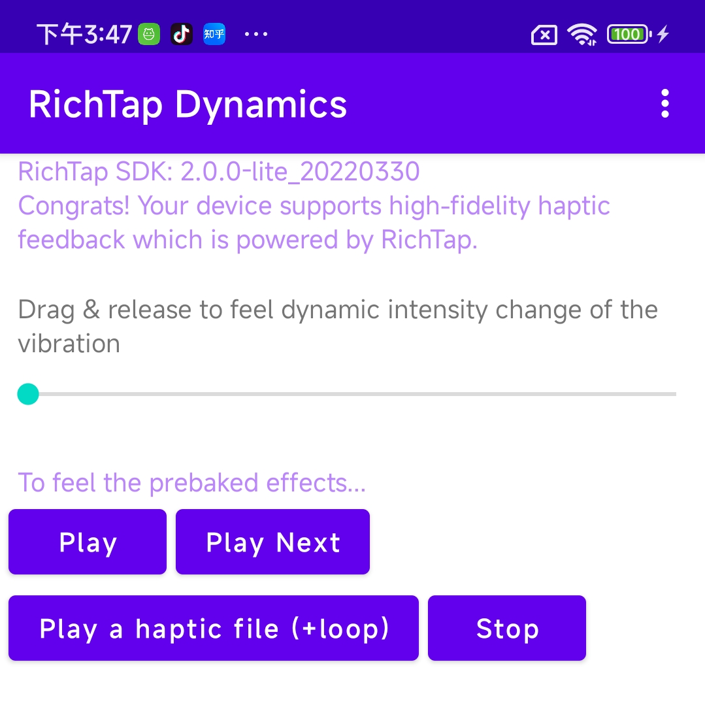
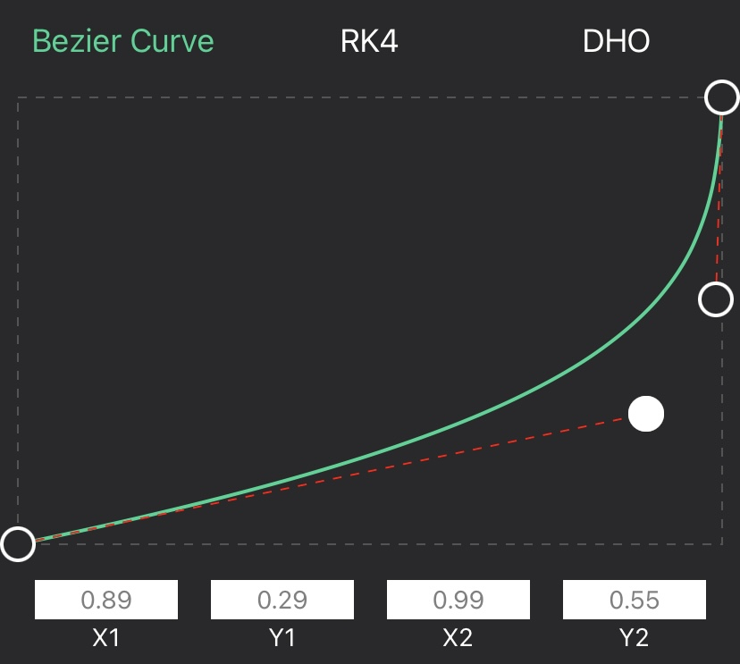

This sample project demonstrates the fundamental usage of RichTap SDK (a lite version of SDK included). You can play a haptic file (with .he file extension) or a JSON string which describes the haptics. You can also change the vibration intensity on the fly. The SDK has 50 effects prebaked, which can be easily integrated into your own App.

本示例演示了RichTap SDK（lite版）的基础功能，包括播放一个.he格式的触感文件，或者符合RichTap规范的触感描述JSON串，循环播放，动态调整振动强度等。SDK还预置了多达50种振动效果，可以轻松集成到您自己的应用中。

In this example we use a Bezier curve to change vibration intensity dynamically, simulating a situation as if we are in the process of dragging the bowstring and then releasing the arrow. 

在本例中，我们演示了使用三阶贝塞尔曲线来动态调整振动强度，模拟了“拉弓-射箭”的过程。
 

